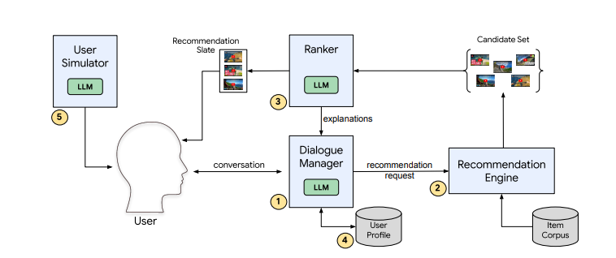

# RecLLM
Leveraging Large Language Models in Conversational Recommender Systems
# RecLLM - LLM-based Conversational Recommender System

RecLLM is a lightweight prototype that simulates a **Conversational Recommender System (CRS)** powered by LLMs. It models how user interaction and recommendation logic can be unified into a language-driven flow.

---

## System Overview

The architecture is inspired by modular LLM-enhanced CRS designs, as shown below:



**Figure: Key components of RecLLM**
1. **Dialogue Manager (LLM)**: Interfaces with the user, maintains dialogue context, and sends recommendation requests to the engine.
2. **Recommendation Engine**: Retrieves candidate items from an item corpus based on the user request.
3. **Ranker (LLM)**: Ranks retrieved items and generates explanations using LLM-driven preference modeling.
4. **User Profile**: Tracks session-level preferences to enhance personalization.
5. **User Simulator (LLM)**: (For research use) Generates synthetic dialogue for training/evaluation purposes.

---

## Project Structure

```
RecLLM/
├── main.py                # Interactive console loop with DialogueManager
├── config.py              # Configuration variables and recommendation data
├── dialogue_manager.py    # Core logic: context tracking and response generation
├── check.py               # Utility to verify API key validity
├── .env                   # Environment variables (e.g., OpenAI key)
├── recLLM_flow.png        # System architecture diagram
```

---

## Getting Started

1. Clone the repository:
```bash
git clone https://github.com/haiyen0607/RecLLM.git
cd RecLLM
```

2. (Optional) Create a virtual environment:
```bash
python -m venv venv
source venv/bin/activate   # On Windows: venv\Scripts\activate
```

3. Add your API key to `.env`:
```
OPENAI_API_KEY=your_api_key_here
```

4. Run the dialogue interface:
```bash
python main.py
```

5. (Optional) Run API key verification:
```bash
python check.py
```

---

## Key Features

- Modular dialogue and recommendation logic
- Extensible to use OpenAI, HuggingFace, or local LLMs
- Easy to simulate ranking, explanations, and profiles
- Synthetic user simulation support (for research)

---

## To-Do / Extensibility

- Integrate real-time LLM responses via OpenAI API
- Implement Ranker using semantic similarity
- Extend Recommendation Engine to connect with vector DB
- Add User Simulator for synthetic conversation generation

---
